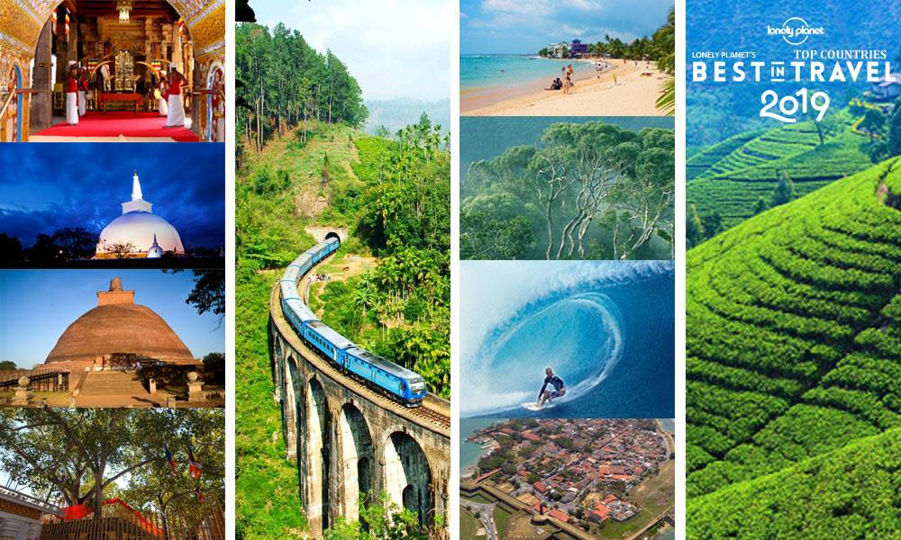

<a href="https://github.com/AU-R-Programming/HW1-9/blob/master/HW1_exer1.Rmd">source</a>

# Exercise 1

## Introduction

<!--
to install and load emoji package)
-->

```{r emo_install, echo=FALSE, message=FALSE, warning=FALSE}

if (!require("emo")) {
  devtools::install_github(("hadley/emo"))
  library(emo)
}

```

### Ana Gabriela Itokazu `` `r emo::ji("speech_balloon")` ``

<!--
defining parameters for the block, image, giphy, and table environments for customized alignment and size
-->

 ```{css, echo=FALSE}
 
  .image {
    display: block;
    margin-left: auto;
    margin-right: auto;
    width: 70%;
  }
  .image p {
    text-align: center;
    font-size: 90%;
  }
  .giphy {
    margin-left: auto;
    margin-right: auto;
    width: 25%;
  }
  .giphyzao {
    margin-left: auto;
    margin-right: auto;
    width: 90%;
  }
  .block {
    text-align: right;
    font-size: 80%;
  }
  .table{
    text-align: center;
    width: 70%;
  
  }

 ```
 
<div class="block">

>"The price of anything is the amount of life you exchange for it.”
> 
> -- @thoreau1993

</div>

<!--
(ugly stuff for the indentation! couldn't fix it in a pretty way, guess ugly will do it)
-->

<div style="text-align: justify">

&nbsp;&nbsp;&nbsp;&nbsp;
I have been working around algae since the my Bachelor's second year. At first, I got tangled in the taxonomy and systematics *i.e.* why we name each algae the way we do, and why that species is not another. Generally, it is a dreary task. We go over long keys, spend hours leaning on a microscope crossing eyes, only to get to the conclusion that "yep, not the same alga". But we do bump into some beauties. To make sure I had the right (or the wrong) one, I'd go over several books and keys, looking for images like the one in <a class="link" href="#cladophora">Figure 1</a>, for example.

</div>

  <div class="image" id="cladophora">
  
  <p class="caption">Figure 1. This is one of the first drawings ever made of a <i>Cladophora</i>, from @kutzing1843.</p>
  </div>
  
<!--

-->

<div style="text-align: justify">  

&nbsp;&nbsp;&nbsp;&nbsp;
Later on, I changed subjects to applied biotechnology, where I played around with toxicology, remediation, pollutant removal, and fell in love with ecological restoration. My undergraduate research advisor, Dr. Leonardo Rorig got a grant to prospect algal species for heavy metal removal. After I graduated, I got into the Biotechnology Graduate Program, and started researching with Algal Turf Scrubber Systems (ATS) for nutrient removal and restoration. ATS is a fairly simple system, with a screen placed on top of a flowlane to providing a physical substratum for algae to attach, and grow. Some people maintain similar systems as a hobby to keep the health of their aquaria at home (see the video by the end of this section)! The goal species vary from filamentous to leafy-like algae, and the optimum for my setup were filamentous macroalgae species, such as *Ulva intestinalis* (see <a class="link" href="#alguinha">Figure 2</a>). We got to study the succession of algae communities, all the way from an algal-bacterial biofilm, to dense turf-like mats of filamentous algae.

</div>
  
  <div class="image" id="alguinha">
  
  <p class="caption">Figure 2. Much better than other people's algae, it is your own.</p>
  </div>
  
<div style="text-align: justify"> 

&nbsp;&nbsp;&nbsp;&nbsp;
During the Latin-American Congress on Sea Sciences (2017) that I had the honor to help organize, Dr. David Blersch went to Brazil to give a talk and contribute in one of the panel sessions. There, we had the opportunity show him the research we were doing and talk about a possible position as research assistant at Auburn University. We coordinated, and I applied for the Ph.D. program in Biosystems Engineering - which was scary because I'm no engineer, but then I got accepted and I was like

</div>

  <div class="giphy" id="wareagle">
  
  <p class="caption"></p>
  </div>
  
<!--  
  <center>
  
  <br>
-->

<div style="text-align: justify">

&nbsp;&nbsp;&nbsp;&nbsp;
For the first couple semesters here, I had to take engineering core courses, such as calculus, thermodynamics, and mechanics of materials, but now my life looks like the table below, and it is pretty nice indeed.

</div>

<center>
| Classes | Time |
|:-|:-|
| STAT 6210 - R Programming for Data Science | MWF 14h-14h50 |
| BSEN 6250 - Deterministic Modeling | T 12h-14h50 Th 9h-11h50 |
| COMP 6130 - Data Mining | MWF 13h-13h50 |
  
<div style="text-align: justify">

&nbsp;&nbsp;&nbsp;&nbsp;
In fact, this document is for STAT 6250, as part of our first homework. And now I'm done! `` `r emo::ji("tada")` `` `` `r emo::ji("balloon")` `` I still need to go ahead and finish the second part, but you know how we feel about homework...

</div>

<!--  
  <div class="giphyzao" id="kbye">
  
  </div>
--> 
 
  <center>
  
  </center>
  <br>
  
  
(But hey, don't forget to click below and watch the DIY Algal Turf Scrubber!)

  <center>

<!--
image for the video: "(...)img.youtube.com/vi/VIDEO_ID/*number*.jpg" where number refers to the frame used on the thumbnail
-->

  <div class="giphy" id="videoalgae">  
  [](https://www.youtube.com/embed/BxhfCRL7mb8&ab_channel=Murphy%27sAquatics)
  </div>
  
  </center>
  
<!--  
  [](https://www.youtube.com/embed/BxhfCRL7mb8&ab_channel=Murphy%27sAquatics)
-->

  
***
### Cary Burdick

<div class="block">

>“I see now that the circumstances of one's birth are irrelevant. It is what you do with the gift of life that determines who you are.”
>
> -- @shudo1998

</div>

#
Hi there, I'm Cary. I'm from Mobile, AL, the original birthplace of Mardi Gras `` `r emo::ji("fleur_de_lis")` ``. Mardi Gras has always been a big holiday in my family. We gather a bunch of friends and family, make a potluck feast of food with plenty of King Cake, and map out the routes of the parades so we can watch them multiple times and maximize the amount of beads and Moon Pies we catch. I always make a point to visit during this time, even when I'm busy with school. I'm still holding out hope that it'll happen next February, but we'll have to see if the pandemic allows it.

  <div class="image" id="kingcake">
  
  <p class="caption">A King Cake adorned with the traditional Mardi Gras colors of purple, green, and gold.</p>
  </div>

#

I'm currently enrolled in the Data Science Master's Program at Auburn. It's a new program that just started in the Fall 2019 semester and it lasts three semesters, so I'll be part of the first cohort to graduate with the degree. I also attended Auburn from 2014-2018 and received my undergraduate degree in Business Analytics, so I've been in Auburn for quite some time now. My final semester is pretty busy, and my class schedule is listed below:

+--------------------------------------------+-------------------------+
|                   Course                   |           Time          |
+:==========================================:+:=======================:+
| STAT 6210 R   Programming for Data Science |   2:00pm - 2:50pm MWF   |
+--------------------------------------------+-------------------------+
| STAT 7940 Capstone Project                 | 1:00pm - 2:15pm T <br> 11:00am - 12:15pm R  |  
+--------------------------------------------+-------------------------+
| COMP 6600 Artificial Intelligence          | 2:00pm - 3:15pm TR      |
+--------------------------------------------+-------------------------+

#

In addition to taking these classes, I also work in the Business Analytics departent as a Graduate Assistant, and I'm working remotely as a part-time employee of Truist Bank `` `r emo::ji("bank")` `` in the Model Risk Management department. Needless to say, I've got a busy schedule:

  <div class="giphy" id="tired">
  
  <p class="caption"></p>
  </div>
  
#
  
But, once this semester finally comes to a close, I'm looking forward to taking a break and getting to visit family again or potentially travel. Of all the places I've been, Positano, Italy `` `r emo::ji("italy")` `` will forever stand out as one of the most beautiful places in the world. I went about 10 years ago and have wanted to go back ever since. Take a look for yourself (although a certain professor reading this may very well already know about it):

  <center>
  
<iframe width="560" height="315" src="https://www.youtube.com/embed/onWsoogDrPw" frameborder="0" allow="accelerometer; autoplay; encrypted-media; gyroscope; picture-in-picture" allowfullscreen></iframe>

#

All in all, After about 6 years of school, I'm ready to be out in the real world. I'm going to take this semester day by day, try my best to stay as organized and motivated as possible with these online classes, and try to keep my mental and physical health in check. I want to be more active and utilize the land around me to do so. I've always been fascinated by the local state park in Auburn known as Chewacla `` `r emo::ji("national_park")` ``, so I'm going to make an effort to find some free time and get out there as often as possible before I leave Auburn.

  <center>
  


***
<div style="text-align: justify"> 
### Harsha Galkanda-Arachchige


#### - Origin

 
I'm Harsha from Sri Lanka, the country call as the "pearl of the Indian Ocean" because of its natural beauty `r emo::ji("star_struck")`. The island contains tropical forests, and a diverse landscape with high biodiversity.
</div>

```{r, echo=FALSE, out.width="75%", fig.cap="It also known as the nation of smiling people"}

```


<div style="text-align: justify"> 
#### - Education

I'm researching on **aquaculture** which is the industry expanding rapidly over the past decade exceeding the annual growth rates of poultry `r emo::ji("chicken")`, pork `r emo::ji("pig")`, dairy `r emo::ji("cow")` and beef `r emo::ji("poultry_leg")` industries to provide animal protein to the world `r emo::ji("fish")`. 
</div>

<div class="block">
>“Total global aquaculture production now exceeds the global capture fisheries production by over 18.32 million tonnes.”
>
> -- @tacon2020trends

</div>

<div style="text-align: justify"> 
This emphasize the importance of aquaculture research to improve its efficiency for further, since we are not expecting a whole lot of fish from ocean to meet the demand `r emo::ji("stars")`. 
</div>


<div style="text-align: justify"> 
#### - Fall 2020 @ Auburn

I have almost completed full credit hours to have my degree `r emo::ji("mortar_board")` and this class of "R programming for Data Science" will be my last class `r emo::ji("sparkles")`.

|                   Course                   |           Time          |
|:------------------------------------------:|:-----------------------:|
| STAT 6210 R   Programming for Data Science | 2:00   pm - 2:50 pm MWF |
| FISH 8990 Research and Dissertation        | TBA                     |

#### - My research

I'm researching on to produce an alternative salt mixture to replace commercial sea salt to rear Pacific white shrimp in inland ventures. In addition, I'm trying to find the effect of different ions and ionic ratios (such as Ca and Mg) in low salinity waters on physiology, growth and survival of shrimp. Hopefully, this project will help to the growth of inland shrimp production sector `r emo::ji("bulb")`.

Following video is on my PhD research (sorry, its a bit longer `r emo::ji("worried")`.)

</div>

<iframe width='500' height='250' src='https://www.youtube.com/embed/O80uI836OM8' frameborder='0' allowfullscreen></iframe


<!-- second part of the exercise: -->
***
***
<div style="text-align: justify">

## R Markdown Syntax

### 1. Misleading Answer

Initially, the code chunk was knitted with r=2, and in the second run, r value was changed in to r=3. 
```{r area, echo=TRUE, cache=TRUE}
r=3
```

Code chunk without "dependson" function. Due to cache=T, already compiled r=2 was used here to calculate the area of the circle, which is incorrect.

```{r circle1, echo=TRUE, cache=TRUE}
a=3.14*r^2
a
```

Code chunk with "dependson" function [dependson=r]. Eventhough cache=T, due to dependson function, correct/updated r value (r=3) was used to calculate area of the circle (a).

```{r circle, echo=TRUE, cache=TRUE, dependson=r}
a=3.14*r^2
a

```
First run with r=2, r-value compile in to the code. This compiled value of r=2 use through the time, when "r" use in formulations. This could easily result misleading outcomes, if it make later changes to the value of r (as I have changed r-value as r=3). You can see two different values for area (a) with r=2 (initial value) and r=3 (changed value). However, "dependson" function specifically point to re-evaluate/verify the already compiled values, which will avoid possible mistakes due to cache=T function. As a result, eventhough r-value was changed, still the code chunk looks for updated r-value to calculate "a". So, in case if r-value change through different sections over time, it is safe to keep cache=F or specify through "dependson" function.

\

### 2. Mean, Median, and Variance

```{r, echo=FALSE}
set.seed(10)
x=rnorm(100)
mean(x)
median(x)
var(x)
```

These results are different from 0 (mean), 0 (median) and 1 (variance) which are the theoretical values of standard normal distribution. However, this result is not surprising as the sample size (100) is low. The probability of getting mean=0 and variance=1 is low as sample size is small. When it increase the size of the sample, the result of mean and variance values become much more closer to the truth.

\

### 3. Histogram


```{r, echo=FALSE, fig.align="center", fig.width=8, fig.height=6, fig.cap="Figure 1: Histogram of x (n=100)"}
hist(x)
```

<div style="text-align: justify">

\

### 4. Equation

[//]: # (equation syntax similar to LaTeX)

Equations can be included as blocks:

\[y = X \beta + \epsilon\]

\

### 5. In-line Equation

Or inline, such as \(A := [a_{i,j}]_{i.j = 1,...,p}\).

\

### 6. Blue Text

<font color="blue">"Keep calm and carry on programming"</font>

\

### 7. Wanna see more?

<button data-toggle="collapse" data-target="#demo">See more</button>
<div id="demo" class="collapse">
Not much more to see

\

### 8. Color Box

<div class="alert alert-success">
  <strong>Ok, let's get this over with:</strong> No, I'm not seasick. Yes, I've always been green. No, I didn't eat grass as a child.
</div>

***
# References
